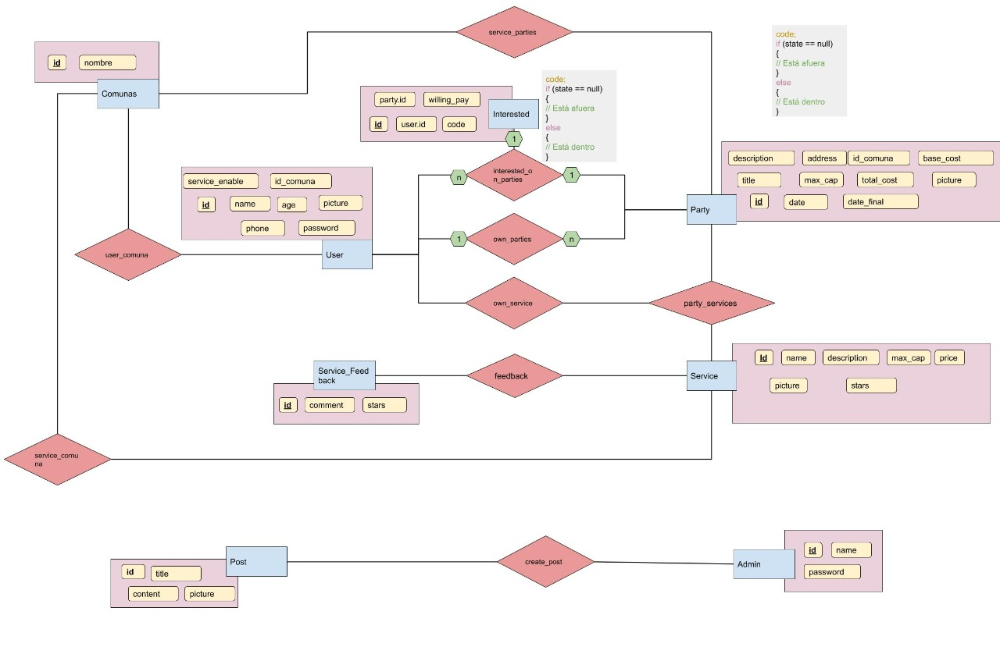

# Gupo 74 :computer: :gem: :diamonds:

#Link a la app: https://carreteapp.herokuapp.com/

#Link del trello: https://trello.com/b/zuDQwG3C/ing-de-software-g74

## Integrantes:

:suspect: Sebastian Villablanca

:rage1: Javier Zagal 

# Entrega 1

## Diagrama Entidad Relacion:

(El archivo tambien esta en la carpeta docs)

## CRUDS:
### Las entidades generadas son las siguientes:

### Usuarios (user):
CRUD completo.

### Admins (admin): 
CRUD completo.

### Comunas (comuna): 
CRUD completo.

### Carretes (party): 
CRUD completo. 

### Servicios (service): 
CRUD completo.

### Posts (post): 
CRUD completo.

### Usuarios interesados en Carretes (interested): 
Se pueden crear, ver y eliminar entidades, concideramos que dada la naturaleza de la tabla no es necesario editar este tipo de entidades.

### Feedbacks de Servicios (feedback): 
Se pueden crear, ver y eliminar entidades, concideramos que no es necesario ni util editar la entidad de feedback.

## Meme:

